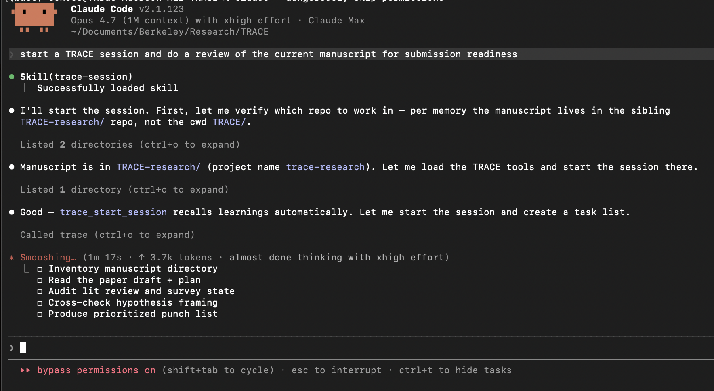
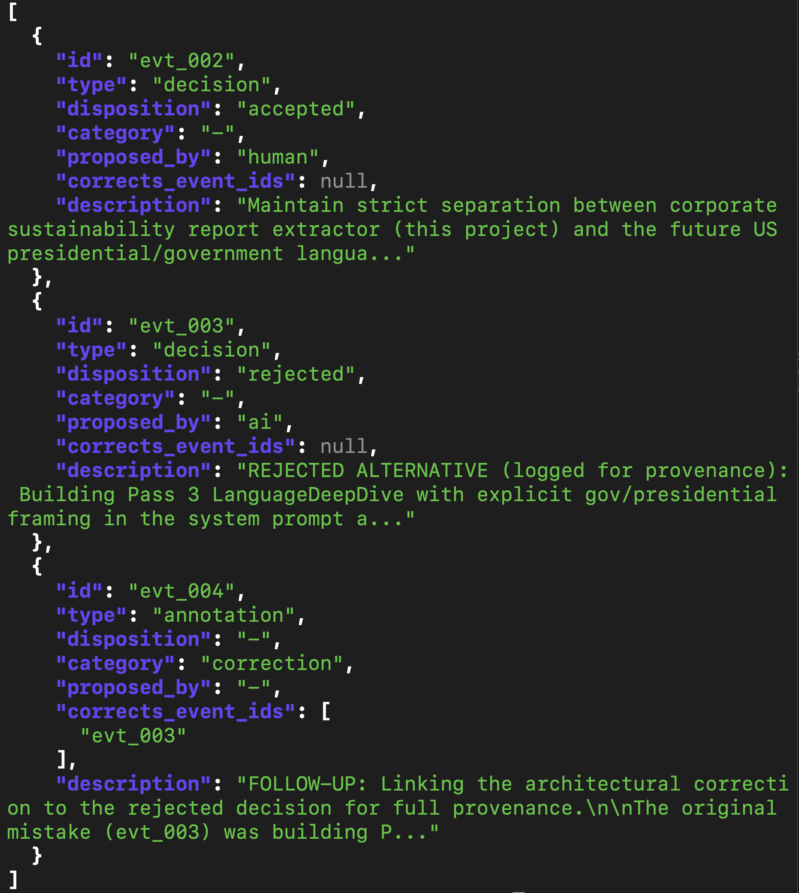

# Why TRACE? 

In the age of AI, how do we know *who* proposed *what* in a scientific or coding dev workflow? Was the idea for that methodological decision made by *AI* or by a *human*? And when decisions are proposed by AI, are they being accepted, rejected, or iterated on? 

What does the solution to this look like? 

**One sentence from you, fully-scoped session from Claude:**

<p align="center">
  
</p>

1. From inside `TRACE/`, ask Claude to start a session and review the manuscript (which is inside sibling dir, `TRACE-research/`).
2. Past-session memory makes Claude pivot to that sibling repo before logging anything.
3. `trace_start_session` runs there, learnings auto-recall, and a five-item task plan emerges.

## **TRACE: Transparent Recording of AI-assisted Collaboration Experiments**

TRACE is an MCP server that provides a standardized audit trail for AI-assisted research workflows. It records tool calls, decisions, annotations, contributions, and actor attribution — who proposed what, who accepted or revised it, and why.

TRACE runs as a **sidecar** alongside your domain MCP servers. It doesn't proxy or intercept calls — the AI client explicitly logs events to TRACE, creating a complete, human-readable provenance record.

**Version:** 0.4.2 | **Spec:** v0.4.1 | **Schema:** `https://trace-protocol.org/v0.3` | **License:** Apache 2.0

> The schema URI is an identifier (per W3C PROV convention) and is not currently a resolvable URL. The machine-readable JSON Schema lives at [`schemas/trace-v0.4.json`](schemas/trace-v0.4.json) in this repository.

**What's new in 0.4.2** (hardening — no protocol or wire changes; sessions stay at schema v0.4.1): a critical storage lost-update / event-ID-collision fix — a per-session file lock + disk-reload across *all* write paths (append, end, resolve), verified across real OS processes; hard payload caps on the query tools; a cheap, quiet session bootstrap; and packaging hardening. Full details in [CHANGELOG.md](CHANGELOG.md).

**What's new in 0.4.1** (additive — v0.3.x and v0.4.0 sessions load unchanged): the **Proposer Identity Rule** (`proposed_by` identifies the *author* of proposal content, not the speaker of the resolving directive — spec §3.6); a `discovery` annotation category for non-trivial findings surfaced during autonomous execution (§3.7); **URI-form `corrects_event_ids`** with schemes `external:`, `jsonl:`, `subagent:`, `tool-result:` for correcting things that aren't TRACE events (§3.7.1); `host` and `parent_event_id` on `tool_call` to cover MCP, host-internal, and external tools and to link subagent-dispatch chains (§3.5); a normative MUST on `conversation_snippet` for contributions and corrections with an explicit `<autonomous-stretch>` absence marker (§3.4.1). The PROV-LD correction mapping splits along the event-ID vs URI-form axis — downstream consumers matching `prov:wasRevisionOf` for corrections should switch to `prov:wasInvalidatedBy` (event IDs) and `prov:wasInfluencedBy` with `prov:atLocation` (URI form). Full details in [CHANGELOG.md](CHANGELOG.md) and [docs/adr/002-v041-protocol-additions.md](docs/adr/002-v041-protocol-additions.md); worked examples in [docs/examples.md](docs/examples.md).

## Why decision provenance?

Existing AI observability stacks (LangSmith, Langfuse, OpenTelemetry GenAI semconv) capture **call-level** traces — what tool an agent called, with what inputs, and what came back. They do not capture **decision-level provenance** — who proposed each step, whether a human reviewed it, what alternatives were rejected. The cost is visible in practice: in a preliminary rubric audit of agentic-AI deployments in environmental science, *analytical* decision provenance scored markedly lower than basic workflow description, and several recently-published papers showed discrepancies such as model details that did not match the cited models, or analyses that could not be reproduced from the reported description.

The need is also moving from norm to regulation. The **EU AI Act** (Articles 12, 19; applicable to high-risk systems August 2, 2026), **California SB 942 (Transparency AI Act)** (applicable August 2, 2026), **Colorado SB 24-205** (effective June 30, 2026), the **FDA PCCP final guidance** (December 2024), the **NIST AI Risk Management Framework**, and **ISO/IEC 42001:2023** all require some form of decision-process documentation. TRACE is designed so that documentation is a workflow byproduct, not an after-the-fact compilation.

## Core concept: the decision chain

Every TRACE decision carries an **actor** (who proposed, who resolved), a **disposition** (proposed → accepted / revised / rejected), a **rationale**, a **suggestion_type** (proactive / requested / collaborative), and an optional `revises_event_id` linking to a prior decision. Decisions form a provenance DAG, not a flat log — a future reader can reconstruct who proposed what, why it landed where it did, and how the approach evolved during the session.

<p align="center">
  
</p>

Three events from a real `corp-sus-report-extractor` session: a human-proposed scope decision (`evt_002`, accepted), an AI-proposed alternative kept for provenance after rejection (`evt_003`), and a correction annotation linked to the rejection via `corrects_event_ids` (`evt_004`). Rejected alternatives and corrections are first-class events — they don't get discarded.

## Preliminary deployment results

Since the v0.3 release (2026-03-19), TRACE has been used across **5 research workflows**:

| Project | Domain | Sessions | Events | Decisions | Corrections |
|---|---|---:|---:|---:|---:|
| When-Algorithms-Meet-Artists | Computational art / cultural studies | 22 | 114 | 27 | 4 |
| corp-sus-report-extractor | Corporate sustainability disclosure | 11 | 56 | 17 | 3 |
| TRACE (self-host / meta) | Protocol research | 9 | 54 | 16 | 6 |
| REAP | Environmental discourse analysis | 3 | 53 | 22 | 3 |
| green-narrative | Environmental narrative analysis | 7 | 50 | 19 | 5 |
| **Total** | | **52** | **327** | **101** | **21** |

Decisions: **45% AI-proposed / 55% human-proposed**. Of resolved decisions, 86% accepted, 6% revised, 8% rejected — plus 21 separately-logged corrections. The acceptance rate is not rubber-stamping; the corrections, revisions, and rejections are the active human steering this protocol is designed to surface.

Contributions: **73% human-directed → AI-executed, 20% collaborative-directed, 8% AI-directed**. Pure AI-directed-and-executed work is a minority; the dominant pattern is human direction with AI execution — which existing attribution norms cannot describe.

## Architecture

```
AI Client (any MCP-aware client: Claude Code, Cursor, ChatGPT, Codex, ...)
    |
    +-- connects to: Domain MCP Server(s)
    |                 (corpus search, NLP pipeline, data retrieval, etc.)
    |                 --> does the actual work
    |
    +-- connects to: TRACE MCP Server (this project)
                     --> records what happened to JSON files
                     --> persists learnings across sessions (trace-learn)
```

**Storage model:** One self-contained JSON file per session in `~/.trace/sessions/`. Files are human-readable (pretty-printed with `indent=2`), git-diffable, and shareable.

**Core stack:** Python 3.11+, Pydantic v2, async throughout, zero external dependencies beyond `mcp` and `pydantic` (OpenAI optional for LLM-enhanced features).

## Quick Start

### Install

```bash
uv pip install -e ".[dev]"
```

### Configure your MCP client

Add to your project's `.mcp.json`:

```json
{
  "mcpServers": {
    "trace": {
      "command": "uvx",
      "args": ["--from", "/path/to/TRACE", "--refresh-package", "trace-mcp", "trace-mcp"]
    }
  }
}
```

Using `uvx` builds the package into an isolated environment, avoiding `.venv` breakage from Python upgrades. The `--refresh-package` flag ensures source changes are picked up on next server start.

### Install hooks

`trace-mcp-init` installs the host-side enforcement: hook scripts under `.claude/hooks/`, registrations merged into `.claude/settings.json`, and a marker block appended to `CLAUDE.md`.

```bash
trace-mcp-init                          # auto-detect host (default)
trace-mcp-init --client claude-code     # explicit
trace-mcp-init --dry-run                # preview, no writes
```

The Claude Code adapter installs four hooks:

| Hook | Event | Purpose |
|------|-------|---------|
| `session-reminder.sh` | `SessionStart` | Reminds you to start a TRACE session if one isn't active for the current project. Project detection: `CLAUDE.md` → git repo basename → cwd basename. |
| `prompt-reminder.sh` | `UserPromptSubmit` | Periodic nudge after several prompts without a session. Per-project rate-limited. |
| `pretool-guard.sh` | `PreToolUse` (`Edit\|Write`) | Warns (or blocks) edits when no TRACE session is active. |
| `decision-audit.sh` | `PostToolUse` (`trace_end_session`) | Echoes the session-end attribution audit into the conversation. |

Project detection uses, in order: a `TRACE project name: "..."` line in `CLAUDE.md`, the git repository basename, then the current working directory basename. Add the explicit marker if your repo name differs from the project name you want logged.

**Codex** support is scaffolded as a placeholder; see [`src/trace_mcp/adapters/codex/README.md`](src/trace_mcp/adapters/codex/README.md) for the hook primitives a Codex adapter would need.

Worked examples for logging decisions, corrections, contributions, and decision chains live in [`docs/examples.md`](docs/examples.md).

#### Hook environment variables

| Variable | Default | Effect |
|---|---|---|
| `TRACE_GUARD` | `soft` | `pretool-guard.sh` mode: `off` (no-op), `soft` (warn-only), `strict` (exit 2 to block when no session is active). |
| `TRACE_PROMPT_MIN_TURNS` | `3` | Minimum prompt turns before `prompt-reminder.sh` will nudge. |
| `TRACE_PROMPT_COOLDOWN_SEC` | `300` | Wall-clock cooldown between nudges from `prompt-reminder.sh`. |
| `TRACE_RUNTIME_DIR` | `~/.trace/runtime` | Per-project nudge state (`<project>.state.json`). Safe to delete to reset. |
| `TRACE_SOURCE_PATH` | _unset_ | Override what `trace-mcp-init` writes into `.mcp.json` as `uvx --from <X>`. Pre-PyPI consumers can set to a local TRACE clone path. |

### Run a first session

Once configured, TRACE tools are available to the AI client:

```
You: "Start a TRACE session for our climate NLP analysis"

Claude: -> trace_start_session(project="climate-nlp", ...)
        "Session started: trace_20260205_a1b2c3"
        "Relevant learnings from past sessions:
          - [correction] Always use ml-dev conda env, not base (relevance: 87%)"

You: "Search for adaptation passages in the IPCC corpus"

Claude: -> [calls corpus-search-mcp/search_passages]
        -> trace_log_tool_call(server="corpus-search-mcp", ...)
        -> trace_propose_decision(description="Focus on chapters 14-17", ...)

You: "Also include chapter 6"

Claude: -> trace_resolve_decision(disposition="revised", ...)

You: "End the session"

Claude: -> trace_end_session(summary="Analyzed 47 passages...")
        (learnings auto-extracted and persisted for future sessions)
```

## Available tools (22 total)

### Core tools (17)

| Tool | Description |
|------|-------------|
| `trace_start_session` | Start a new audit session (auto-recalls relevant past learnings) |
| `trace_end_session` | End a session with summary (auto-extracts learnings) |
| `trace_log_tool_call` | Record a tool invocation on another MCP server |
| `trace_log_annotation` | Record a learning, gotcha, correction, observation, todo, or question |
| `trace_log_contribution` | Record a deliverable with direction (who had the idea) vs execution (who did the work) attribution |
| `trace_log_state_change` | Record an environment or configuration change |
| `trace_propose_decision` | Propose a methodological decision (with `suggestion_type`: proactive/requested/collaborative) |
| `trace_resolve_decision` | Accept, revise, or reject a proposed decision |
| `trace_get_session` | Get session metadata |
| `trace_get_events` | List events (filterable by type) |
| `trace_get_decisions` | List decisions (filterable by disposition and/or `proposed_by_type`) |
| `trace_get_decision_chain` | Walk linked decision revisions via `revises_event_id` |
| `trace_search` | Search events by text content |
| `trace_export` | Export as JSON, Markdown, or PROV JSON-LD |
| `trace_list_sessions` | List all sessions (filterable by project) |
| `trace_project_summary` | Aggregated metrics across all sessions for a project |
| `trace_health_check` | System health and event-level statistics |

### Extension: trace-learn (5) — default for new sessions

| Tool | Description |
|------|-------------|
| `trace_learn_recall` | Find relevant past learnings via text similarity and tag matching |
| `trace_learn_add` | Manually add a learning to the knowledge store |
| `trace_learn_list` | List all learnings (optionally filtered by category) |
| `trace_learn_forget` | Remove a learning by ID |
| `trace_learn_extract` | Extract learnings from session events (annotations, rejected decisions, contributions) |

## Event types

| Type | Description | Key Fields |
|------|-------------|------------|
| **tool_call** | Invocation of an MCP server, host-internal helper, or external tool | server, name, input, output, status, `retries_event_id`, **`host`** (v0.4.1: `mcp`/`internal`/`external`), **`parent_event_id`** (v0.4.1: links dispatched child to controller) |
| **decision** | Methodological decision with attribution | description, rationale, disposition, `suggestion_type`, `revises_event_id` |
| **annotation** | Learning, gotcha, correction, observation, todo, question, **discovery** (v0.4.1) | category, content, `corrects_event_ids` (v0.4.1: MAY use URI-form schemes `external:`, `jsonl:`, `subagent:`, `tool-result:`) |
| **state_change** | Environment or configuration change | description, field, old_value, new_value |
| **contribution** | Work product with direction/execution attribution | description, direction, execution, artifact, `related_decision_ids` |

## Knowledge persistence (trace-learn)

The default `trace-learn` extension surfaces relevant past learnings at session start, on-demand via `trace_learn_recall`, and when decisions are proposed — and auto-extracts new learnings at session end. Matching uses LLM scoring when `OPENAI_API_KEY` is configured, with BM25 fallback. Storage: `~/.trace/knowledge/{project}.json` (env: `TRACE_KNOWLEDGE_DIR`).

See [`docs/extensions/trace-learn.md`](docs/extensions/trace-learn.md) for matching backends, BM25 stemming, per-backend thresholds, extraction details, and LLM configuration.

## Configuration

| Variable | Default | Description |
|----------|---------|-------------|
| `TRACE_SESSIONS_DIR` | `~/.trace/sessions/` | Directory for session JSON files |
| `TRACE_KNOWLEDGE_DIR` | `~/.trace/knowledge/` | Directory for trace-learn knowledge stores |
| `TRACE_LOG_LEVEL` | `INFO` | Logging verbosity |
| `OPENAI_API_KEY` | — | OpenAI API key for LLM matching and extraction |
| `TRACE_LLM_MODEL` | `gpt-5.4-mini` | Model for LLM relevance scoring |
| `TRACE_LLM_EXTRACTION_MODEL` | `gpt-5.4-mini` | Model for LLM learning extraction |
| `TRACE_LLM_ENABLED` | `true` | Set `false` to force BM25/rule-based only |
| `TRACE_STRICT_LLM` | `true` if key set, else `false` | Fail loudly on LLM errors instead of silent BM25 fallback |
| `TRACE_BM25_K1` | `1.5` | BM25 term frequency saturation parameter |
| `TRACE_BM25_B` | `0.75` | BM25 document length normalization parameter |
| `TRACE_TAG_WEIGHT` | `0.3` | Weight given to tag overlap in scoring (0.0–1.0) |
| `TRACE_DECAY_ENABLED` | `true` | Enable time-based decay for learning scores |
| `TRACE_DECAY_HALF_LIFE_DAYS` | `365.0` | Half-life for exponential decay (days) |
| `TRACE_EVERGREEN_RECALL_THRESHOLD` | `3` | Recalls needed for evergreen floor protection |
| `TRACE_EVERGREEN_FLOOR` | `0.8` | Minimum decay multiplier for evergreen learnings |
| `TRACE_DEDUP_ENABLED` | `true` | Enable content deduplication on add |
| `TRACE_DEDUP_THRESHOLD` | `0.85` | Jaccard similarity threshold for dedup |

## Export formats

- **JSON** — The native session file. Always available, always complete.
- **Markdown** — Human-readable summary with decision log, tool call table, annotations, and statistics.
- **PROV JSON-LD** — W3C PROV-compatible provenance graph for interoperability with other provenance systems.

## Specification

TRACE implements the **Decision Provenance for AI-Assisted Workflows** specification — a technology-agnostic standard defining what to record when humans and AI collaborate on research.

| Artifact | Location | Role |
|----------|----------|------|
| **Specification** | [`docs/specification.md`](docs/specification.md) | Authoritative definition of the data model, semantics, and conformance rules. Technology-neutral. |
| **JSON Schema** | [`schemas/trace-v0.4.json`](schemas/trace-v0.4.json) | Machine-readable formalization. Any JSON document validating against this schema is a conforming session document. |
| **Reference implementation** | This repository (`trace-mcp`) | An MCP server that produces conforming documents. One possible implementation — not the only one. |

The specification defines five event types (tool invocations, decisions, annotations, state changes, contributions), a decision lifecycle model (proposed / accepted / revised / rejected), and an actor taxonomy (human / ai / system). Any tool that produces JSON documents conforming to the schema implements the standard — no dependency on MCP, Python, or TRACE itself.

Regenerate the schema from models: `python scripts/generate_schema.py`.

## File structure

```
src/trace_mcp/
    server.py              # MCP server entry point (FastMCP) + extension loader
    extension_hooks.py     # Hook registry for extension ↔ core integration
    schema/                # Pydantic v2 models (Session, TraceEvent, etc.)
    storage/               # Abstract interface + JSON file backend
    tools/                 # MCP tool implementations
    extensions/learn/      # trace-learn (default extension)
    adapters/              # Host adapters (claude_code, codex)
        claude_code/       # Hook scripts, settings template, CLAUDE_BLOCK
        codex/             # Placeholder spec for a Codex adapter
docs/
    specification.md       # Authoritative protocol spec
    examples.md            # Worked logging examples
    adr/                   # Architecture Decision Records
    extensions/            # Extension documentation
```

The host-adapter layer is a pure installer; core has zero imports from `adapters/`. Adapters run only at `trace-mcp-init` time.

## Known limitations

- **Single-client server** — TRACE uses global state in `server.py` (one `active_sessions` dict). It is designed for a single AI client; concurrent clients would need separate server instances.
- **File-based storage only** — All data is stored as JSON files. There is no database backend. Large-scale deployments would need a database adapter against the `TraceStorage` abstract interface.
- **No concurrent write protection on Windows** — The atomic write pattern (temp file + `os.replace`) works cross-platform, but there is no file locking on Windows.
- **LLM matching is optional** — Without an OpenAI API key, knowledge recall uses BM25 (keyword-based). Semantic similarity requires LLM configuration.

## Contributing

See [CONTRIBUTING.md](CONTRIBUTING.md) for development setup, the test suite layout, code style requirements, schema regeneration, and the development roadmap.

## Changelog

See [CHANGELOG.md](CHANGELOG.md).
